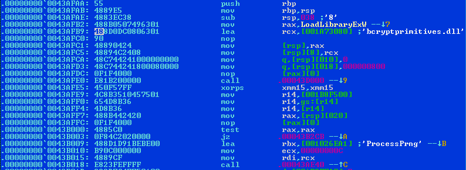

# Golang fixer for Windows 7

## What's the point?
Recently, I've observed that **all** programs compiled with Go version 1.21.5 or newer will crash on startup
when run on **Windows 7 / Windows Server 2008**, displaying the following error:

```
Exception 0xc0000005 0x8 0x0 0x0
PC=0x0

runtime.asmstdcall(0x104)
...src/runtime/sys_windows_amd64.s:75 +0x7a fp=0x68619ff700 sp=0x68619ff6e0 pc=0x2e3c9a
rax     0x0
rbx     0x3c05f8
rcx     0x44540a
rdx     0x20
rdi     0x686167d000
rsi     0x68619ff900
rbp     0x68619ff840
rsp     0x68619ff6d8
r8      0x0
r9      0x68619ff990
r10     0x444c13
r11     0x7ff594ba0222
r12     0x0
r13     0x0
r14     0x3bfc80
r15     0x0
rip     0x0
rflags  0x10293
cs      0x33
fs      0x53
gs      0x2b
```

## Why?
Thanks to [this commit](https://github.com/golang/go/commit/9e43850a3298a9b8b1162ba0033d4c53f8637571), all Windows .EXE files generated by the Go compiler are
non-functional and will crash upon starting on Windows 7 and Windows Server 2008.

Previous versions of the Go runtime utilized [RtlGenRandom](https://learn.microsoft.com/en-us/windows/win32/api/ntsecapi/nf-ntsecapi-rtlgenrandom),
also known as `SystemFunction036` from `advapi32.dll` library, which is present
in all Windows versions dating back to **Windows XP**.

However, this function was later replaced with [ProcessPrng](https://learn.microsoft.com/en-us/windows/win32/seccng/processprng)
from `bcryptprimitives.dll` , which exists only on Windows 8 and newer. The two
functions have a similar prototype, but still differ in return values.

## TL;DR Is there a fix?
Yes. If you prefer not to revert the aforementioned patch and rebuild every Go
program for Windows 7 from source yourself, or you're just an user and want
to fix your Syncthing or Torrserver, proceed.

Just [download it from Releases](https://github.com/stunndard/golangwin7patch/releases)
and run it on your Windows 7 system to patch the necessary .EXE files.
Or build it yourself, using the free
[Delphi 11 Community Edition](https://www.embarcadero.com/products/delphi/starter).

This patcher is applicable to all Windows Go executables, regardless of whether you have
access to their source, and supports both 32-bit and 64-bit .EXEs.

As of writing this, I've verified it to work with the following Go executables
on Windows 7:
[Hugo](https://github.com/gohugoio/hugo/releases),
[Syncthing](https://github.com/syncthing/syncthing/releases),
[Torrserver](https://github.com/YouROK/TorrServer/releases),
[Netbird](https://github.com/netbirdio/netbird/issues/1307#issuecomment-2266315261) all of which were previously
non-functional on Windows 7 until patched. Let me know if there's something that doesn't work.

## How patch works
The Go runtime dynamically loads the relevant DLLs, including `bcryptprimitives.dll`,
and utilizes `LoadLibraryEx` with specific flags to restrict DLL loading to the
Windows System directory (to prevent DLL hijacking).

It also uses the hardcoded string lengths for the library and function names:



Unfortunately, it makes binary patching more complicated and error prone in the
future, if (say when) the binary code changes due to a new version of the
Go compiler.

With the above things in mind, the patch is simple: change only one byte
in the library name, i.e. `bcryptprimitives.dll` to `acryptprimitives.dll` and
drop the `acryptprimitives.dll` in the Windows System directory.

The new `acryptprimitives.dll` is a tiny proxy DLL that just calls the old
`SystemFunction036` function within its exported `ProcessPrng` function.

## Discussion
As per this [https://en.wikipedia.org/wiki/CryptGenRandom](https://en.wikipedia.org/wiki/CryptGenRandom),
there were no critical flaws in `RtlGenRandom` on Windows 7, and moreover, it
wraps the same `ProcessPrng` function:

```
All userspace calls to fetch randomness, be it CryptGenRandom or RtlGenRandom,
ultimately fall to ProcessPrng, which returns bytes from the process's per-processor PRNG.
```

So, for reasons unknown, and in favor of totally unnesessary change, they opted to
completely break all Windows 7 compatibilty silently, showing just an exception
with CPU registers dump to all Windows 7 users.

This action leaves Windows 7 users completely unable to benefit from
software compiled with the newer Go versions, (who said security updates, no security for you!)
with issues closed due to [being an unsupported platform](https://github.com/golang/go/issues/64622),
among other less accommodating practices.

